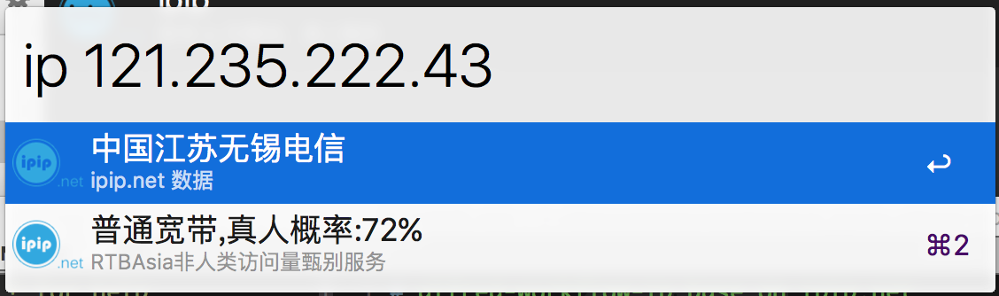
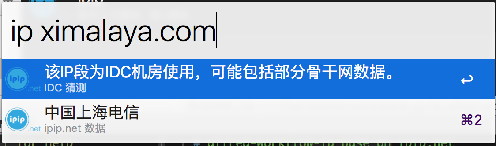
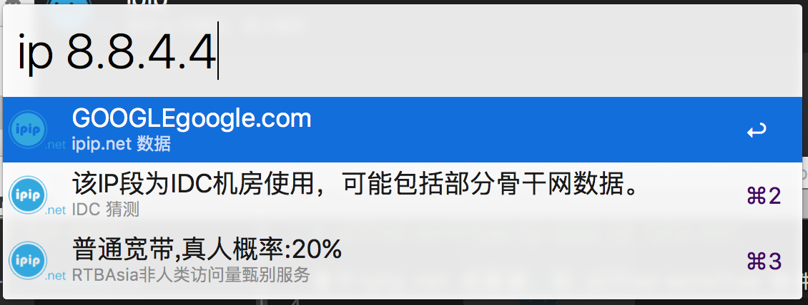
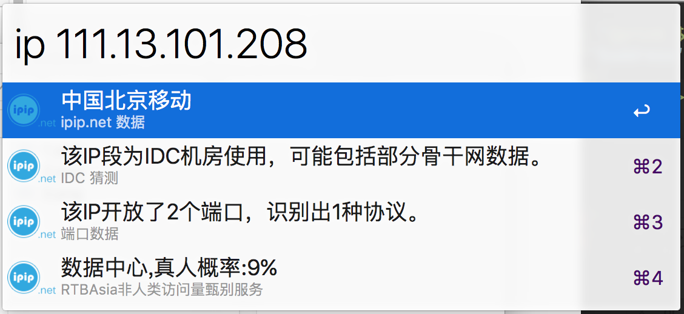

# alfred-workflow-ipip base on ipip.net

an IP query plugin for alfred-workflow(2/3) without any dependence

data is from [ipip.net](https://www.ipip.net/)

# download

[ipip.alfredworkflow](https://github.com/caorong/ipip-alfred-workflow/releases/download/1.0.0/ipip.alfredworkflow)

# how to use

key work: ip

ip 8.8.4.4

ip ximalaya.com

## screenshots

